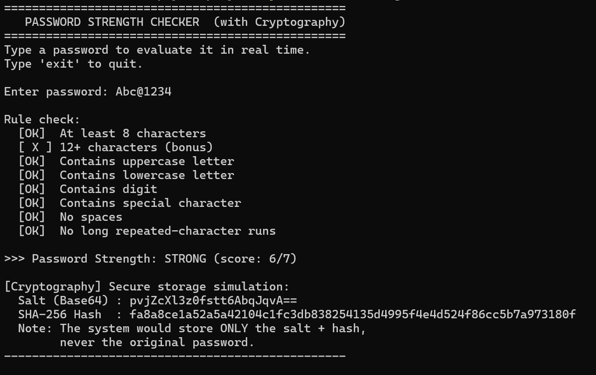
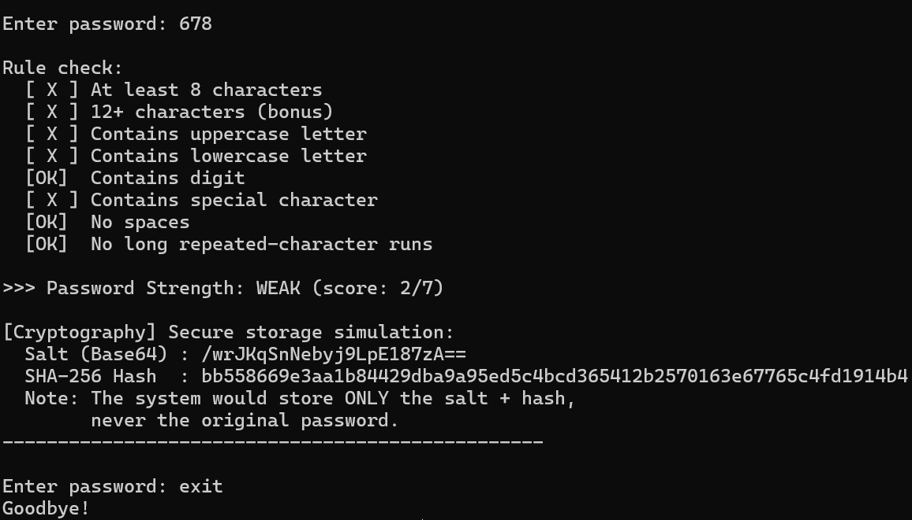

# 🔐 Password Strength Checker

A Java console application that evaluates password strength using **regular expressions (Regex)** and demonstrates **secure password storage** through **salted SHA-256 hashing**.

## 📌 Overview

This project analyzes a user-entered password against common security rules and classifies it as **Weak**, **Medium**, or **Strong**. It also demonstrates how passwords should be securely stored using **salted SHA-256 hashing** instead of plain text.

## 📷 Demo




## ✨ Features

- Evaluate password strength in real time
- Classify passwords as **Weak**, **Medium**, or **Strong**
- Validate password based on:
  - Minimum length (8 characters)
  - Strong length bonus (12+ characters)
  - Uppercase letters
  - Lowercase letters
  - Digits
  - Special characters
  - No whitespace
  - No repeated character sequences
- Generate a cryptographically secure random salt
- Compute a SHA-256 salted hash
- Interactive console-based interface

## 🛠️ Technologies Used

- Java
- Regular Expressions (Regex)
- SHA-256
- SecureRandom
- Base64 Encoding

## 📂 Project Structure

```
Password-Strength-Checker/
│
├── PasswordStrengthChecker.java
├── README.md
└── .gitignore
```

## 🚀 How to Run

### Compile

```bash
javac PasswordStrengthChecker.java
```

### Run

```bash
java PasswordStrengthChecker
```

## 💻 Sample Output

```
=================================================
   PASSWORD STRENGTH CHECKER (with Cryptography)
=================================================

Enter password: Hello@123

Rule check:
[OK] At least 8 characters
[OK] Contains uppercase letter
[OK] Contains lowercase letter
[OK] Contains digit
[OK] Contains special character

>>> Password Strength: STRONG

[Cryptography]
Salt (Base64): ...
SHA-256 Hash : ...
```

## 🔒 Password Evaluation Rules

| Rule | Description |
|------|-------------|
| Minimum Length | At least 8 characters |
| Strong Length | 12 or more characters |
| Uppercase Letter | At least one uppercase letter |
| Lowercase Letter | At least one lowercase letter |
| Digit | At least one numeric digit |
| Special Character | At least one special character |
| No Spaces | Password should not contain spaces |
| Repeated Characters | Avoid long repeated character sequences |

## 🔐 Cryptography Demonstration

The application demonstrates the concept of **salted password hashing**:

1. Generate a secure random 16-byte salt.
2. Combine the salt with the password.
3. Compute the SHA-256 hash.
4. Store only the **salt** and the **hashed password**.

This approach helps protect passwords against rainbow table attacks and avoids storing passwords in plain text.

## 📚 Concepts Demonstrated

- Object-Oriented Programming (OOP)
- String Manipulation
- Regular Expressions (Regex)
- Cryptography Basics
- SHA-256 Hashing
- Secure Password Storage
- Java Console Application Development

